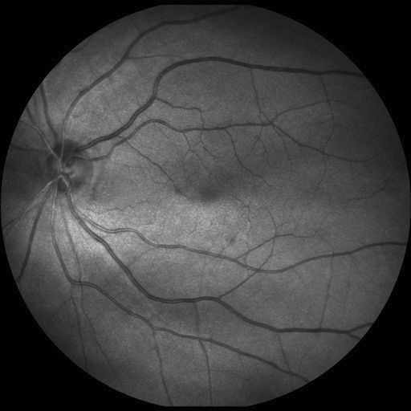
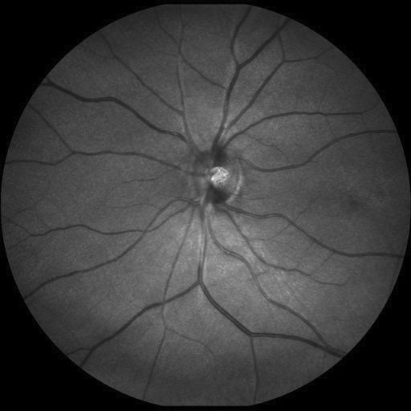
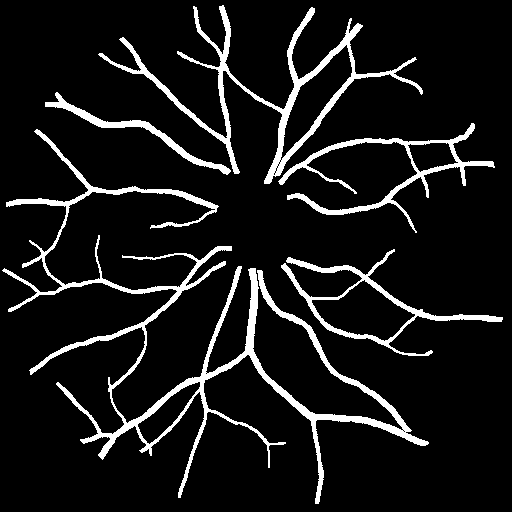

# Vascular Network Segmentation

## Context of the project

**Scanning laser ophthalmoscopy** (SLO) is an imaging modality for the retina that enables a high-resolution, wide-field fundus to be produced, and therefore most of the surface of the retina to be observed in a single image at a resolution of between 10 and 100 μm.  
In addition to diseases of the retina itself, fundus observation can be used to diagnose a number of general pathologies by observing the arterial and venous circulation in the retina. This is particularly the case with arterial hypertension and renal insufficiency. Diagnosis is generally based on a quantitative analysis of the entire vascular network of the retinal image, and therefore requires precise segmentation of this network.  
This project aims at proposing an automatic method for segmenting the vascular network in SLO retinal images. The following images show two examples of SLO images, together with ground truth images, corresponding to manual annotations by an expert.

| SLO fundus 1 | Ground truth 1 | SLO fundus 2 | Ground truth 2 |
:-------------------------:|:-------------------------:|:-------------------------:|:-------------------------:|
  |   |   |  

## Dataset

The data - images and annotations - were extracted from IDIAP's [IOSTAR database](https://www.idiap.ch/software/bob/docs/bob/bob.db.iostar/stable/) for the evaluation of retinal vascular network segmentation algorithms. Only 10 images were used, they are located in the [images_IOSTAR](./images_IOSTAR) folder.  
Given the small number of images, no machine learning based methodes were used. One of the aims of the project was also to familiarise myself with classic image processing methods, such as mathematical morphology.  

The jupyter notebook contains the code and explanations of the processing, the PDF is a succint report on the results and the approach used for this project.
